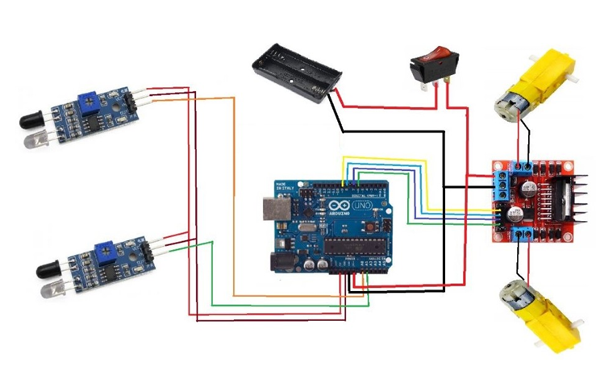

# LINE FOLLOWING ARDUINO CAR

## Overview
This project implements an autonomous **line-following robot** using an **Arduino Uno**, IR sensors, and DC motors.  
The robot is designed to detect and follow a predefined path by continuously sensing the line position and adjusting motor motion in real time.

The project demonstrates fundamental concepts of **embedded systems**, **sensor interfacing**, and **basic robotics control**.

---

## Objectives
- To design and build an autonomous line-following robot
- To understand IR sensor-based line detection
- To interface sensors and motors with Arduino
- To implement real-time motor control logic for navigation

---

## Working Principle
IR sensors mounted beneath the robot continuously detect the surface below.  
When the sensor detects a **white surface**, it reflects more infrared light, whereas a **black line** reflects less.

The Arduino reads the sensor outputs and determines the position of the line:
- If both sensors detect white → robot moves forward
- If the left sensor detects black → robot turns left
- If the right sensor detects black → robot turns right
- If both sensors detect black → robot stops

Based on these conditions, the Arduino controls the motors through a motor driver to keep the robot aligned with the path.

---

## Components Used
- Arduino Uno R3
- IR Sensors
- BO DC Motors
- Motor Driver Module
- 18650 Battery and battery holder
- Wheels (normal + 360-degree wheel)
- Connecting wires
- Robot chassis

---
## Circuit Diagram
The circuit diagram below shows the connections between the Arduino Uno, IR sensors, motor driver, and DC motors used in the line-following car.

---
## Control Logic
- Sensor inputs are read digitally
- Motor direction and speed are controlled using GPIO pins
- PWM signals are used to drive motors at constant speed
- Real-time decision-making ensures smooth line tracking

---

## Results
- The robot successfully followed straight and curved paths
- Accurate detection of line using IR sensors
- Stable movement after sensor calibration and testing
- Minor issues such as alignment and sensitivity were resolved through iteration

---

## Limitations
- Performance depends on surface contrast
- Fixed-speed operation
- Not suitable for uneven terrain

---

## Future Improvements
- Implement PID control for smoother turns
- Add speed control based on curve detection
- Integrate obstacle detection sensors
- Wireless monitoring or control
- Support for complex track patterns

---

## Conclusion
The line-following Arduino car effectively demonstrates autonomous navigation using simple sensors and control logic.  
This project provides a strong foundation in robotics, sensor interfacing, and embedded system design, making it a practical introduction to autonomous systems.
